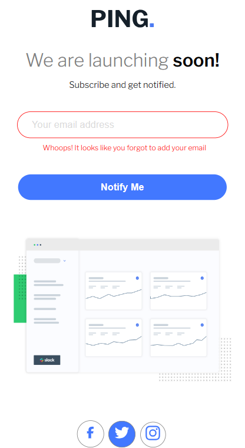

# Frontend Mentor - Ping coming soon page solution

This is a solution to the [Ping coming soon page challenge on Frontend Mentor](https://www.frontendmentor.io/challenges/ping-single-column-coming-soon-page-5cadd051fec04111f7b848da). Frontend Mentor challenges help you improve your coding skills by building realistic projects. 

## Table of contents

- [Overview](#overview)
  - [The challenge](#the-challenge)
  - [Screenshot](#screenshot)
  - [Links](#links)
- [My process](#my-process)
  - [Built with](#built-with)
  - [What I learned](#what-i-learned)
  - [Continued development](#continued-development)
  - [Useful resources](#useful-resources)
- [Author](#author)
- [Acknowledgments](#acknowledgments)

### Screenshot

### Links

- Solution URL: (https://www.frontendmentor.io/solutions/pingcomingsoonpage-X5uouZymV_https://www.frontendmentor.io/solutions/pingcomingsoonpage-X5uouZymV_)
- Live Site URL: (https://main-ping-coing-soon-page.netlify.app/)

## My process
- Created the desktop design first
- Styled with CSS and some little bit of JS
- Worked on creating the mobile design
- Styled using CSS media queries
- Make button interactive
- Display an animation popup

### Built with

- Semantic HTML5 markup
- CSS custom properties
- Flexbox
- JavaScript (variables, functions, DOM etc...)

### What I learned
- CSS animations
- ::before and ::after

### Continued development
- CSS animations
- Responsiveness
- JS functions and libraries

### Useful resources
- (https://www.youtube.com/watch?v=B0_M1y4aFAQ)
-ChatGPT

## Author

- Frontend Mentor - [@AshongAbdallah06](https://www.frontendmentor.io/profile/AshongAbdallah06)
- Twitter - [@XuGaR_2_0_0_6](https://www.twitter.com/XuGaR_2_0_0_6)

## Acknowledgments

- Net Ninja on YouTube (https://www.youtube.com/watch?v=B0_M1y4aFAQ)
